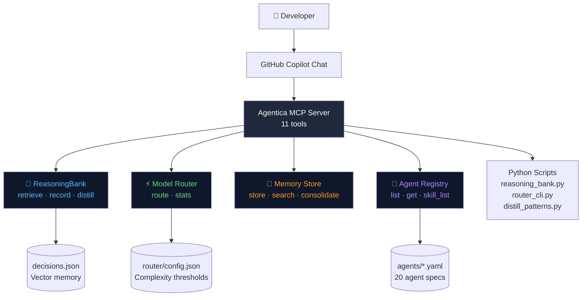

<div align="center">


# Agentica v2

### The Self-Learning AI Agent Kit for VS Code & GitHub Copilot

[](LICENSE)
[](https://nodejs.org)
[](https://python.org)
[](https://modelcontextprotocol.io)
[](https://code.visualstudio.com)
[](https://github.com/ashrafmusa/agentica)

**20 specialist agents · ReasoningBank · Model Router · MCP Server · Self-Learning**

[Quick Start](#-quick-start) · [Features](#-features) · [Agents](#-20-specialist-agents) · [Compare](#-vs-competitors) · [Docs](#-documentation)

</div>

---

## What Is Agentica?

Agentica is a **production-grade AI agent kit** that plugs into VS Code and GitHub Copilot. It gives your AI assistant a **persistent memory**, **intelligent model routing**, and **20 specialist agents** that know your exact codebase patterns — getting smarter every time you use it.

```
Before Agentica:  Generic Copilot response → same answer every time
After Agentica:   "Found similar pattern (similarity: 0.91). Reusing the auth decision from 2 weeks ago..."
```

---

## ✨ Features

### 🧠 ReasoningBank — AI That Learns From Your Work
Store past decisions as searchable vector memory. Next time you face a similar problem, Agentica finds the pattern and **skips re-planning entirely** (Fast Path).

```bash
# After solving a problem:
python scripts/reasoning_bank.py record \
  --task "Add Stripe webhooks" \
  --decision "Use raw body parser before JSON middleware" \
  --outcome "Webhook signature verified correctly" \
  --success true

# Next time you ask about payment integrations:
# → similarity: 0.93 → Fast Path activated → 60% fewer tokens
```

### ⚡ Model Router — Stop Overpaying for Simple Tasks
Automatically selects the right model tier based on task complexity. A typo fix doesn't need the same model as architecting a distributed system.

```
Fix a typo         → lite   model  (1¢)
Add dark mode      → flash  model  (3¢)
Architect platform → pro    model  (15¢)
                                    ↑ 40% average savings
```

### 🤖 20 Specialist Agents — The Right Expert for Every Task
Each agent has deep domain expertise, coding rules, and boundaries. Copilot automatically picks the right one.

```
@frontend-specialist  → React, Tailwind, animations, no purple
@backend-specialist   → APIs, databases, rate limiting
@security-auditor     → OWASP, auth reviews, Firestore rules
@debugger             → 5-layer root cause analysis
@orchestrator         → Multi-agent planning
```

### 🔌 MCP Server — 11 Tools for Any MCP Host
Works with **VS Code + GitHub Copilot**, **Claude Desktop**, **Cursor**, and any MCP-compatible host.

```json
// .vscode/mcp.json
{
  "servers": {
    "agentica": {
      "type": "stdio",
      "command": "node",
      "args": ["path/to/agentica/mcp/server.js"]
    }
  }
}
```

### 📦 Project-Aware — One Kit, All Your Projects
Install into any project in 30 seconds. Each project gets its own learning memory.

```bash
npx agentica init                              # current directory
npx agentica init --path d:\Projects\MyApp    # specific project
npx agentica init --mode full                  # with local memory
```

---

## 🚀 Quick Start

### Prerequisites
- [Node.js 20+](https://nodejs.org)
- [Python 3.11+](https://python.org)
- [VS Code](https://code.visualstudio.com) with [GitHub Copilot](https://github.com/features/copilot)

### Option A: npx (Recommended)
```bash
# Install into your current project
npx agentica init

# Or into a specific project
npx agentica init --path /path/to/your/project --mode full
```

### Option B: Clone & Setup
```bash
git clone https://github.com/ashrafmusa/agentica.git
cd agentica

# Windows
powershell -ExecutionPolicy Bypass -File setup.ps1

# macOS/Linux
chmod +x setup.sh && ./setup.sh
```

### Activate in VS Code
1. Open your project in VS Code
2. Open Copilot Chat (`Ctrl+Alt+I`)
3. Click **🔧 Tools** icon → Enable **"agentica"**
4. Start using agents:

```
@debugger the /api/users 401 error even with valid token
@frontend-specialist build a dashboard card with Recharts
@orchestrator I need to add payments — plan it
```

---

## 🤖 20 Specialist Agents

| Agent | Domain | Auto-Invoked When |
|-------|--------|-------------------|
| `orchestrator` | Multi-domain planning | Complex multi-file tasks |
| `frontend-specialist` | React, Next.js, CSS | UI/component work |
| `backend-specialist` | APIs, Node.js, databases | Server/API work |
| `mobile-developer` | React Native, Capacitor | Mobile features |
| `database-architect` | Prisma, SQL, Firestore | Schema/query work |
| `debugger` | Root cause analysis | Any bug/error |
| `security-auditor` | OWASP, auth, rules | Security reviews |
| `devops-engineer` | CI/CD, Docker, deploy | Infrastructure |
| `test-engineer` | Jest, Playwright, E2E | Testing |
| `qa-automation-engineer` | QA flows, automation | Quality assurance |
| `performance-optimizer` | Lighthouse, bundles | Speed issues |
| `penetration-tester` | Pen testing, CVEs | Security testing |
| `explorer-agent` | Codebase discovery | Find files/deps |
| `code-archaeologist` | Legacy code analysis | Understanding old code |
| `documentation-writer` | Docs, READMEs | Documentation |
| `game-developer` | Phaser, game loops | Game development |
| `seo-specialist` | Core Web Vitals, meta | SEO work |
| `product-manager` | PRDs, requirements | Product planning |
| `product-owner` | Backlog, user stories | Agile tasks |
| `project-planner` | Roadmaps, phases | Project planning |

---

## 📊 vs. Competitors

| Feature | **Agentica v2** | Cursor Rules | Continue.dev | Cline | claude-flows |
|---------|:-----------:|:------------:|:------------:|:-----:|:------------:|
| Persistent memory | ✅ ReasoningBank | ❌ | ❌ | ❌ | ❌ |
| Self-learning | ✅ Pattern distillation | ❌ | ❌ | ❌ | ❌ |
| Model routing | ✅ Cost-aware | ❌ | ❌ | ❌ | ❌ |
| Specialist agents | ✅ 20 agents | ❌ Single | ❌ Single | ❌ Single | ⚠️ Basic |
| MCP server | ✅ 11 tools | ❌ | ⚠️ Limited | ❌ | ❌ |
| VS Code + Copilot | ✅ Deep integration | ⚠️ Cursor only | ✅ | ⚠️ | ❌ |
| Per-project memory | ✅ `.agentica/` | ❌ | ❌ | ❌ | ❌ |
| Team knowledge sync | ✅ via git | ❌ | ❌ | ❌ | ❌ |
| Token optimization | ✅ ~40% savings | ❌ | ❌ | ❌ | ❌ |
| YAML agent specs | ✅ Schema-validated | ❌ | ❌ | ❌ | ❌ |
| Zero infrastructure | ✅ JSON-based | ✅ | ✅ | ✅ | ✅ |
| Open source | ✅ MIT | ✅ | ✅ | ✅ | ✅ |

---

## 🏗️ Architecture



---

## 🛠️ MCP Tools Reference

| Tool | Description |
|------|-------------|
| `reasoningbank_retrieve` | Search past decisions by semantic similarity |
| `reasoningbank_record` | Save a successful solution for future reuse |
| `reasoningbank_distill` | Extract recurring patterns from decisions |
| `router_route` | Get optimal model + strategy for a task |
| `router_stats` | Show router config and token savings |
| `memory_store` | Save key/value memory with tags and score |
| `memory_search` | Full-text + tag search across memory entries |
| `memory_consolidate` | Prune stale entries, keep top-ranked |
| `agent_list` | Browse all 20 agents with metadata |
| `agent_get` | Get full spec for a specific agent |
| `skill_list` | List all 36 skills by tier (Core/Domain/Utility) |

---

## 📚 Documentation

| Doc | Description |
|-----|-------------|
| [ARCHITECTURE.md](ARCHITECTURE.md) | Full system architecture and data flow |
| [USAGE.md](USAGE.md) | Complete usage guide with CLI reference |
| [HOW-TO-USE-ON-YOUR-PROJECT.md](HOW-TO-USE-ON-YOUR-PROJECT.md) | Installing into any project |
| [CHANGELOG.md](CHANGELOG.md) | Version history |
| [CONTRIBUTING.md](CONTRIBUTING.md) | How to contribute |

---

## 🔧 CLI Reference

```bash
# ReasoningBank
python scripts/reasoning_bank.py retrieve "implement pagination" --k 5
python scripts/reasoning_bank.py record --task "T" --decision "D" --outcome "O" --success true
python scripts/reasoning_bank.py stats
python scripts/reasoning_bank.py distill

# Model Router
python scripts/router_cli.py "build a payment system"
python scripts/router_cli.py "fix a typo" --compact   # → MODEL=lite SCORE=1.0

# Pattern Distillation
python scripts/distill_patterns.py
python scripts/distill_patterns.py --dry-run

# Health Check
python scripts/verify_all.py .

# MCP Server
cd mcp && node server.js
```

---

## 🧩 Skill Tiers

| Tier | Skills | Load Strategy |
|------|--------|---------------|
| **1 — Core** | `clean-code`, `brainstorming`, `plan-writing`, `intelligent-routing`, `behavioral-modes`, `parallel-agents` | Always |
| **2 — Domain** | `frontend-design`, `mobile-design`, `api-patterns`, `database-design`, `testing-patterns`, `architecture` + 4 more | Domain match |
| **3 — Utility** | `seo-fundamentals`, `vulnerability-scanner`, `performance-profiling` + 23 more | Explicit need |

---

## 🤝 Contributing

Contributions are welcome! See [CONTRIBUTING.md](CONTRIBUTING.md) for guidelines.

```bash
# Add a new agent
cp agents/frontend-specialist.yaml agents/your-agent.yaml
# Edit the YAML, then validate:
node scripts/lint-agents.js

# Add a skill
mkdir skills/your-skill
# Create SKILL.md with frontmatter (see schemas/skill-schema.json)

# Submit a PR — CI will validate all agents and skills automatically
```

---

## 📄 License

MIT © [Agentica Contributors](LICENSE)

---

<div align="center">

**Made with ❤️ using Agentica — [⭐ Star on GitHub](https://github.com/ashrafmusa/agentica)**

</div>
